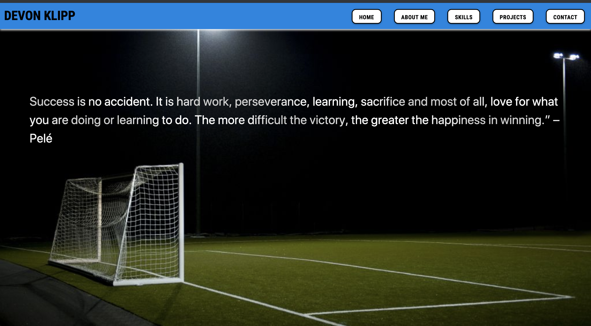
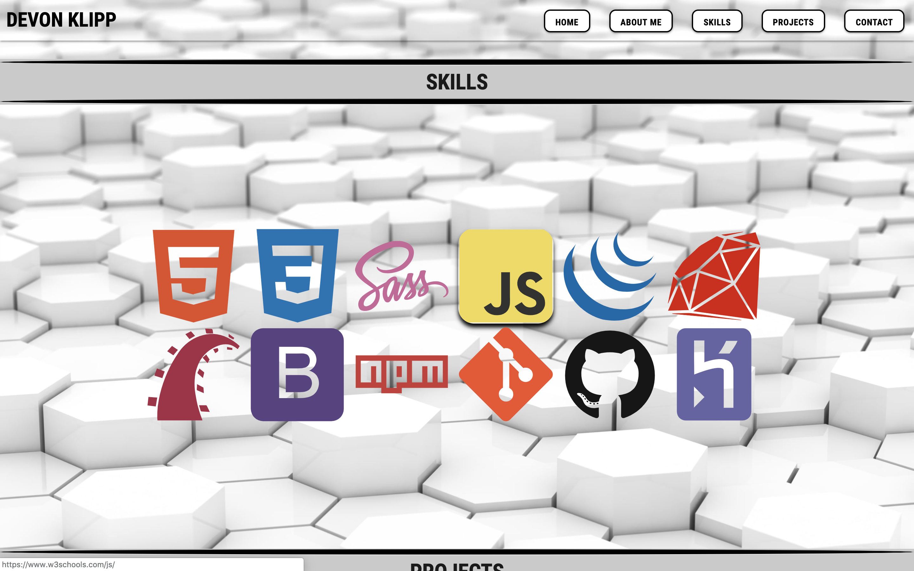
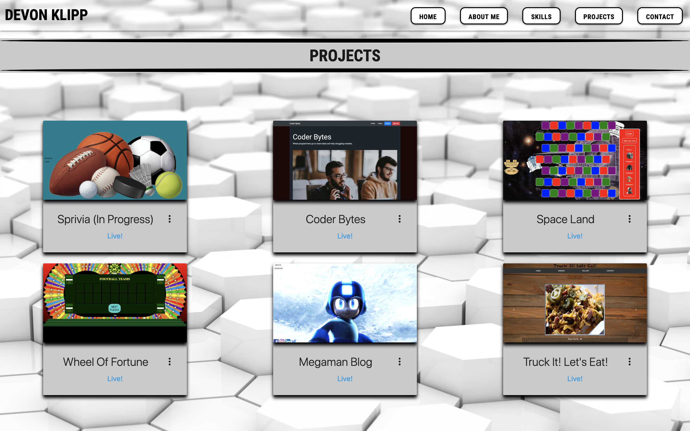

# Klippman.github.io (Portfolio)

This is my personal, static website. It explains a little about my history, my skillsets, projects and contact information.
Utilized html5, CSS3, JavaScript, jQuery and Materialize css library during development. Materialize is a modern responsive CSS framework based on Material Design by Google.

