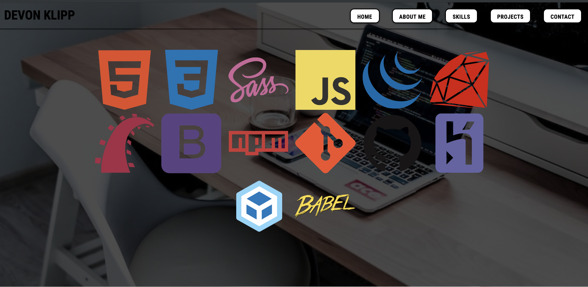
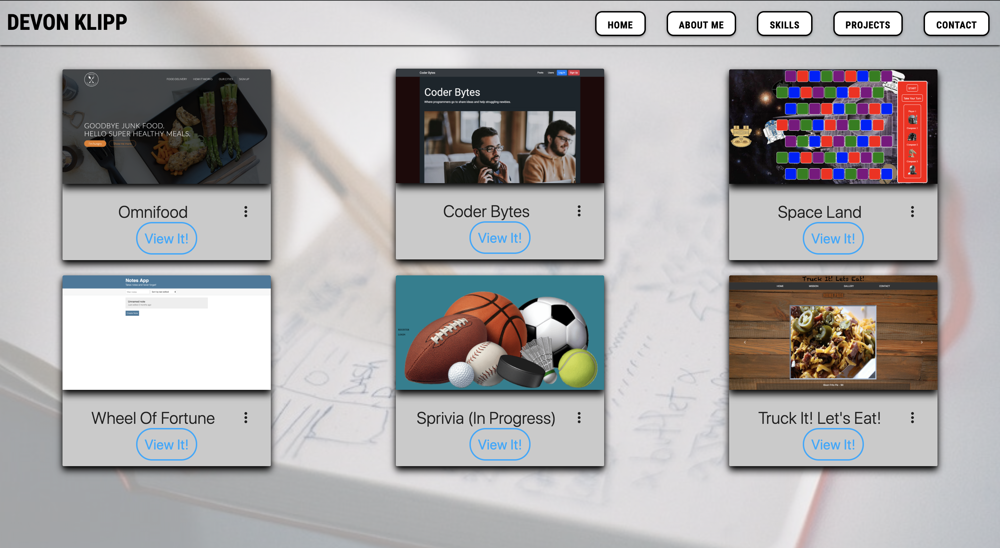

# Klippman.github.io (Portfolio)

This is my personal, static website. It explains a little about my history, my skillsets, projects and contact information.

Utilized html5, CSS, JavaScript and Materialize css library during development.

